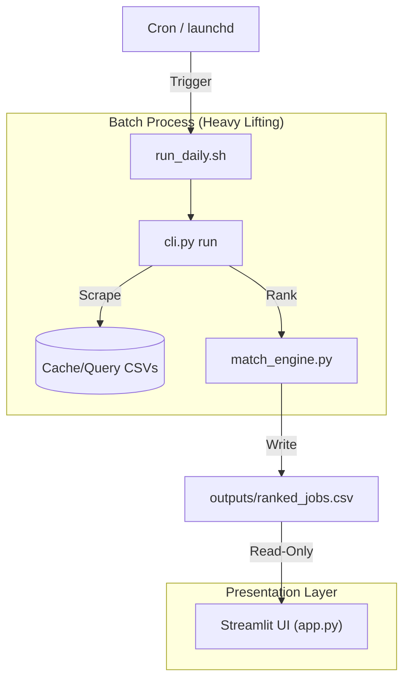
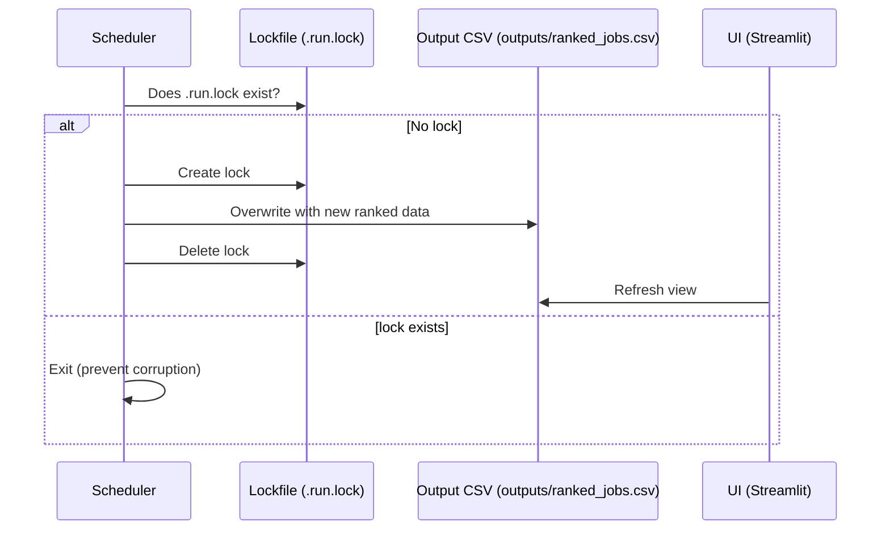

# 🌊 Calm-First Job Ranker

A **batch‑first, deterministic job discovery and ranking system** for **Senior Individual Contributor (IC) roles** in AI, GenAI, MLOps, and platform engineering.

The pipeline is deliberately split:

* **CLI / batch** – does all scraping, LLM calls, and expensive work.  
* **Streamlit UI** – only **reads** a final CSV; it never scrapes, embeds, or mutates state.

---

## 📐 High‑Level Architecture

The data flows strictly one way:



*All heavy‑lifting* lives in the **batch layer** (`cli.py`, `run_daily.sh`).  
*The UI layer* (`app.py`) only displays what the batch layer produces.

---

## 🧠 Core Concepts

| Concept | Why it matters |
|---------|----------------|
| **Batch‑First** | Guarantees reproducible, fault‑tolerant runs; the UI is a passive consumer. |
| **Senior‑IC Only** | Hard filters drop *Principal*, *Manager*, *Director/VP*, *Security*, *Cyber*; only IC titles remain. |
| **macOS‑Safe** | Multiprocessing is gated to the CLI via `sitecustomize.py`; Streamlit never spawns subprocesses. |
| **Deterministic** | Cached queries, role classifications, and embeddings enable reproducible outputs. |
| **One‑Writer, Many‑Readers** | `outputs/ranked_jobs.csv` is overwritten atomically with a lockfile (`outputs/.run.lock`). |

---

## 📂 Repository Layout

```text
scrape_jobs/
├── cli.py                # Primary batch entrypoint
├── match_engine.py       # Ranking logic + hard filters
├── build_corpus.py       # Deduplicated global corpus
├── build_faiss_corpus.py # Pre‑compute corpus embeddings (FAISS)
├── run_daily.sh          # Daily batch runner (Entrypoint)
├── app.py                # Streamlit viewer (read‑only)
├── cache/                # Query‑level caches (72 h TTL)
├── outputs/              # Final ranked CSVs + .run.lock
└── profiles.py           # Role profiles & filters
```

*`process_and_ingest.py`* lives in `scrape_jobs/` and **post‑processes** `outputs/ranked_jobs.csv`:

* removes long descriptions & URLs,
* writes `ranked_jobs_head.csv` (first 5 rows, clean format),
* runs `gitingest` with exclusions,
* is used **before committing** or **sharing** results.

Run it with:

```bash
python process_and_ingest.py
```

---

## 🛠 Installation & Setup

### 1. Environment

```bash
python -m venv .venv
source .venv/bin/activate
pip install -r requirements.txt

# Optional LLM integration
export OPENROUTER_API_KEY=your_key_here
```

### 2. Verify OpenMP safety

If you hit OpenMP errors on macOS, ensure `sitecustomize.py` is present (it forces OpenMP to single‑thread for the CLI).

---

## 🚀 CLI Usage (Primary Interface)

### One‑Shot Run (Recommended)

Fetches new jobs, applies filters, and updates the ranked snapshot **in one command**.

```bash
python cli.py run \
  --resume users/Uday_Lunawat/resume.tex \
  --search "mlops engineer|genai engineer|ff forward deployed engineer" \
  --user uday \
  --profile senior_ic \
  --country India
```

*What happens (in order)*  

1. Scrape fresh jobs (or reuse cache if recent)  
2. Apply **hard role filters** (`Manager`, `Principal`, etc. are dropped)  
3. Load the embeddings cache (or compute FAISS if missing)  
4. Score jobs with **semantic similarity**, **company weighting**, **recency decay**  
5. Write `outputs/ranked_jobs.csv` overwriting any previous snapshot  

### Rank Against Corpus (Fastest, Read‑Only)

If you already have a pre‑built FAISS index, use this mode to skip scraping.

```bash
python cli.py run \
  --resume users/Uday_Lunawat/resume.tex \
  --rank-corpus \
  --user uday \
  --profile senior_ic
```

*Fails fast* if FAISS data is missing; otherwise returns the **most deterministic ranking**.

### Build FAISS Corpus (One‑Time Heavy Step)

```bash
python build_faiss_corpus.py
```

*Computes embeddings once*; afterwards ranking becomes **sub‑second**.

### Corpus Build (Optional but Recommended)

```bash
python build_corpus.py
```

Creates `corpus/jobs_corpus.csv` – a deduplicated, stable set of jobs from all tracked sources.

---

## ⚙️ macOS Automation (launchd)

The system can be run as a **background service** using `launchd` instead of cron.

### Installing the launchd Agent

```bash
mkdir -p ~/Library/LaunchAgents

cat << 'EOF' > ~/Library/LaunchAgents/com.uday.job_ranker.scheduler.plist
<?xml version="1.0" encoding="UTF-8"?>
<!DOCTYPE plist PUBLIC "-//Apple//DTD PLIST 1.0//EN" "[http://www.apple.com/DTDs/PropertyList-1.0.dtd](http://www.apple.com/DTDs/PropertyList-1.0.dtd)">
<plist version="1.0">
<dict>
  <key>Label</key>
  <string>com.uday.job_ranker.scheduler</string>
  <key>ProgramArguments</key>
  <array>
    <string>/usr/local/bin/python3</string>
    <string>/Users/udaylunawat/Projects/job_ranker/scrape_jobs/scheduler.py</string>
  </array>
  <key>RunAtLoad</key>
  <true/>
  <key>KeepAlive</key>
  <true/>
  <key>WorkingDirectory</key>
  <string>/Users/udaylunawat/Projects/job_ranker/scrape_jobs</string>
  <key>StandardOutPath</key>
  <string>/Users/udaylunawat/job_ranker_launchd.out</string>
  <key>StandardErrorPath</key>
  <string>/Users/udaylunawat/job_ranker_launchd.err</string>
</dict>
</plist>
EOF

launchctl load ~/Library/LaunchAgents/com.uday.job_ranker.scheduler.plist
```

### Locking & Overwrite Semantics (Diagram)



*Result*: Only one process may write the CSV at a time, guaranteeing **no partial or corrupted files**.

---

## 🔒 Process & Ingest (`process_and_ingest.py`)


**When to use it**

* Before committing any changes to version control.  
* Before sharing results with a team.  
* Before creating audit diffs.  

The script **never mutates** `ranked_jobs.csv`; it produces a fresh, minimal artifact (`ranked_jobs_head.csv`) that is safe for `git` ingestion.

Run it with:

```bash
python process_and_ingest.py
```

*Why it exists*: `ranked_jobs.csv` contains long descriptions, URLs, and other metadata that bloat repositories and obscure diffs. The ingest step strips that away, leaving a clean, human‑readable preview.

---

## 📜 Logs & Debugging

```bash
# View scheduler logs
tail -f ~/job_ranker_launchd.out

# Force a fresh run (clears current snapshot)
rm -f outputs/ranked_jobs.csv
launchctl unload ~/Library/LaunchAgents/com.uday.job_ranker.scheduler.plist
launchctl load ~/Library/LaunchAgents/com.uday.job_ranker.scheduler.plist
```

---

## 🛠 Permissions & Executability

Make the batch runner executable:

```bash
chmod +x scrape_jobs/run_daily.sh
```

---

## 🧩 Profiles (Configuration)

`profiles.py` defines:

* **senior_ic** – default optimization (IC‑only, no managers)  
* **junior_ic** – alternative with relaxed filters  

You can extend it with custom keywords, company whitelists, or LLM toggles.

```python
# Example snippet from profiles.py
SENIOR_IC = {
    "exclude_roles": ["Principal", "Manager", "Director", "VP", "Security", "Cyber"],
    "preferred_companies": ["Google", "Meta", "Amazon"],
    "use_llm": True,
}
```

---

## 📊 Quick Reference – What to Run & When

| Task | Command | Frequency |
|------|---------|-----------|
| Fetch jobs | `python cli.py fetch --search "mlops engineer|genai engineer" --country India --profile senior_ic` | manual / when cache stale |
| Build corpus | `python build_corpus.py` | weekly |
| Build FAISS | `python build_faiss_corpus.py` | once (or when corpus changes) |
| Daily ranking | `./run_daily.sh` (or via launchd) | daily |
| Post‑process & ingest | `python process_and_ingest.py` | before sharing / committing |
| View results | `streamlit run app.py` | anytime |
| Force scheduler refresh | (see “Logs & Debugging”) | manual recovery |

---

## 🔐 Operating Principles (Collapsible)

<details>
  <summary>Click for principles</summary>

* **Heuristics before LLMs** – regex filters for forbidden roles run *before* any LLM call.  
* **Cache aggressively, prune deterministically** – 72 h TTL, max 50 query files; pruning logic lives in `cache_loader.py`.  
* **One writer, many readers** – only `cli.py`/`run_daily.sh` writes to `outputs/`; the UI only reads.  
* **Deterministic time complexity** – ranking is $O(n \log n)$ where $n$ is the corpus size; bound is enforced by FAISS pre‑index.  
* **Google Jobs rule** – copy queries verbatim; avoid Boolean `OR`; LLM query expansion is disabled for these sources.  
  </details>

---

## 🛠💡 Additional Resources (Collapsible)

<details>
  <summary>One‑page daily‑operator checklist</summary>

```
# Daily Operator Checklist
1. Check lockfile: `ls outputs/.run.lock` – should NOT exist.
2. Pull latest scheduler logs: `tail -n 20 ~/job_ranker_launchd.out`.
3. Verify fresh CSV: `wc -l outputs/ranked_jobs.csv`.
4. Confirm no forbidden titles slipped through:
   `grep -iE "principal|manager|director|vp|security|cyber" outputs/ranked_jobs.csv || echo "clean"`.
5. If lock exists or CSV stale → run manually:
   `./run_daily.sh`.
6. Optionally ingest clean preview:
   `python process_and_ingest.py && git add ranked_jobs_head.csv && git commit -m "daily snapshot"`.
7. Push to remote if needed: `git push`.
```

</details>

---

## 🚀 Getting Started (Collapsible)

<details>
  <summary>One‑time bootstrap (copy‑paste)</summary>

```bash
# Clone repo
git clone https://github.com/your-org/job_ranker.git
cd job_ranker

# Create venv
python -m venv .venv && source .venv/bin/activate

# Install deps
pip install -r requirements.txt

# Optional: set OpenRouter key
export OPENROUTER_API_KEY=your_key_here

# Test a full run
python cli.py run --resume users/Uday_Lunawat/resume.tex --search "mlops engineer" --user uday --profile senior_ic --country India

# Start UI
streamlit run app.py
```

</details>

---

*Because the system is deliberately **calm**—it does the heavy work once, caches results, and then serves a static, deterministic CSV—your downstream tools (git, dashboards, audit pipelines) can rely on it without fearing hidden side‑effects.*  

--- 

*Happy hunting!*
