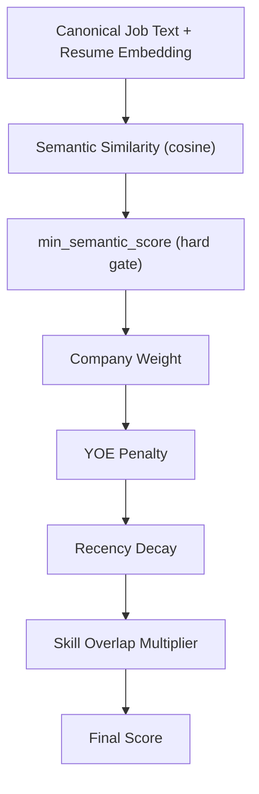

# Calm-First Job Ranker — V2 Production Architecture
## Diagram 1: System Architecture (Authority & Data Flow)

```mermaid
%% =========================================================
%% Diagram 1 (REPLACEMENT): System Architecture
%% Calm-First Job Ranker — V2 (Balanced, Production Layout)
%% =========================================================
flowchart LR
    %% ---------------- LEFT: LLM ----------------
    subgraph LLM["LLM (Advisory Only)"]
        LLMCore["Large Language Model"]
    end

    %% ---------------- ALLOWED ----------------
    subgraph Allowed["Allowed LLM Usage"]
        QP["Search Query Planning"]
        RD["Resume Distillation\n(Semantic Compression)"]
        EX["Optional NL Explanations"]
    end

    %% ---------------- BOUNDARY ----------------
    Boundary["Determinism Boundary\n(HARD)"]

    %% ---------------- BATCH CORE ----------------
    subgraph Batch["Batch Intelligence Layer (Authoritative)"]
        RP["Resume Pipeline\n(distill → canonicalize)"]
        FI["FAISS Index\n(user-scoped)"]

        subgraph Core["Scoring Core (Pure Deterministic)"]
            FL["Filtering Rules"]
            RL["Ranking Logic"]
            SF["Scoring Functions"]
        end

        OUT["outputs/\nranked_jobs.csv\nlast_seen_jobs.csv\nrun_meta.json"]
    end

    %% ---------------- UI ----------------
    subgraph UI["Presentation Layer (Read-Only)"]
        Home["app.py\n(Home / Session)"]
        Dash["Dashboard"]
        QS["QuickScan"]
        Logs["Logs"]
    end

    %% ---------------- FLOWS ----------------
    LLMCore --> QP
    LLMCore --> RD
    LLMCore --> EX

    QP --> Boundary
    RD --> Boundary

    Boundary --> RP
    RP --> FI
    FI --> FL
    FL --> RL
    RL --> SF
    SF --> OUT

    OUT --> Home
    Home --> Dash
    Home --> QS
    Home --> Logs

    %% ---------------- FORBIDDEN ----------------
    LLMCore -. "FORBIDDEN" .-> FL
    LLMCore -. "FORBIDDEN" .-> RL
    LLMCore -. "FORBIDDEN" .-> SF
```
## Diagram 2: Scoring Pipeline (Exact Execution Order)

```mermaid
flowchart TD
    Input["Canonical Job Text + Resume Embedding"]

    Semantic["Semantic Similarity (cosine)"]
    Gate["min_semantic_score (hard gate)"]
    Company["Company Weight"]
    YOE["YOE Penalty"]
    Recency["Recency Decay"]
    Skill["Skill Overlap Multiplier"]

    Final["Final Score"]

    Input --> Semantic
    Semantic --> Gate
    Gate --> Company
    Company --> YOE
    YOE --> Recency
    Recency --> Skill
    Skill --> Final
```